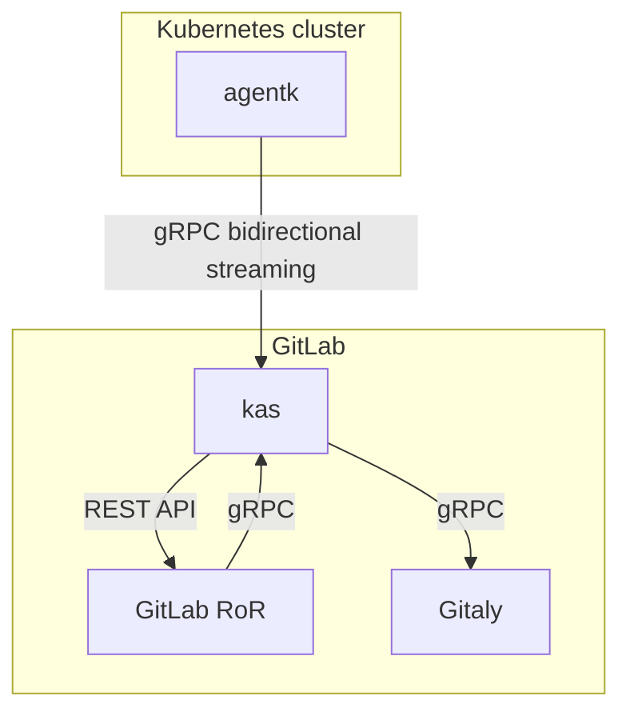

Pull-based GitOps : Why ?
======================================================================


* * *


The [GitLab Agent for Kubernetes (`agentk`)](https://gitlab.com/gitlab-org/cluster-integration/gitlab-agent) is an active in-cluster component for solving GitLab and Kubernetes integration tasks in a secure and cloud-native way. The `agentk` communicates to the GitLab Agent Server (KAS) to perform GitOps operations.

## Push-based Gitops : NOT RECOMMENDED in Production systems


  Push-based approach: A CI/CD tool pushes the changes to the environment. Applying GitOps via push is consistent with the approach used for application deployment. In this case, deployment targets for a push-based approach are not limited to Kubernetes.

*   configure GitLab CI/CD to use the Kubernetes API to query and update your cluster

*   K8s credentials exposed in GitLab

*   This workflow has a weaker security model and is not recommended for production deployments.

- Use this push-based workflow:
  ```
  - When you have a heavily pipeline-oriented processes.
  - When you need to migrate to the agent but the GitOps workflow cannot support the use case you need.
  ```


Problem to Solve[](https://about.gitlab.com/blog/2021/09/10/setting-up-the-k-agent/#Problem-to-Solve)
----------------------------------------------------------------------------------------------------
Currently the Kubernetes integration for Gitlab, both on premise installations and Gitlab.com, work by having the Gitlab installation and the Gitlab runners connect directly to the Kubernetes cluster you wish to manage via Gitlab, using credentials we store inside the Gitlab installation (in the database).

For on premise installations, this simple model works relatively well, where typically the Kubernetes installation and the Gitlab instance are in the same or similar security domains, and connectivity between one and the other is relatively straightforward.

For Gitlab.com, this model has a number of drawbacks. It means that on premise uses must expose their Kubernetes clusters masters to the internet, and it also means that depending on the features they are using of Gitlab, they may have to give Gitlab what is essentially full root privileges on their Kubernetes cluster to Gitlab.com to store and use.

For some users, this risk profile is acceptable, but for others, in more highly secure environments, or with clusters in large multi-tenant environments where they don't get full privileges with the cluster, this can be a blocker to adoption of Gitlab.com Kubernetes features.

We would like to come up with an alternative solution where Kubernetes clusters masters are able to be kept from having to be exposed to the internet, and also ideally the solution would not involve Gitlab.com having to store the credential/having knowledge of the credential itself.


Why pull-based Gtops[](https://about.gitlab.com/blog/2021/09/10/setting-up-the-k-agent/#Why-pull-based-Gtops)
------------------------------------------------------------------------------------------------------------


*   Integrate a cluster, located behind a firewall or NAT, with GitLab
    Gitlab agent residing inside k8s cluster initiates any changes from inside the cluster. This is more secure.

*   Kubernetes cluster-admin level credentials not exposed to CI/CD Gitlab.com

*   GitLab pull-based Gitops allows granular access to Gitlab.com CD. Gitlab agent service account provided
    granular access to k8s namespaces to alow operations only for those namespace.

*   Kubernetes manifests reside in GitLab

*   GitLab agent installed in k8s cluster

*   Any update to k8s manifests in GitLab, the k8s-agent pulls and updates the k8s cluster 

*   This workflow is fully driven with Git and is considered pull-based, because the cluster is pulling updates from your GitLab repository.


## High-level architecture : Pull-based Gitops

The GitLab Agent and the GitLab Agent Server use
[bidirectional streaming](https://grpc.io/docs/what-is-grpc/core-concepts/#bidirectional-streaming-rpc)
to allow the connection acceptor (the gRPC server, GitLab Agent Server) to
act as a client. The connection acceptor sends requests as gRPC replies. The client-server
relationship is inverted because the connection must be initiated from inside the
Kubernetes cluster to bypass any firewall or NAT the cluster may be located behind.
To learn more about this inversion, read
[issue #212810](https://gitlab.com/gitlab-org/gitlab/-/issues/212810).

This diagram describes how GitLab (`GitLab RoR`), the GitLab Agent (`agentk`), and the GitLab Agent Server (`kas`) work together.



- `GitLab RoR` is the main GitLab application. It uses gRPC to talk to `kas`.
- `agentk` is the GitLab Agent. It keeps a connection established to a
  `kas` instance, waiting for requests to process. It may also actively send information
  about things happening in the cluster.
- `kas` is the GitLab Agent Server, and is responsible for:
  - Accepting requests from `agentk`.
  - [Authentication of requests](https://gitlab.com/gitlab-org/cluster-integration/gitlab-agent/-/blob/master/doc/identity_and_auth.md) from `agentk` by querying `GitLab RoR`.
  - Fetching agent's configuration from a corresponding Git repository by querying Gitaly.
  - Matching incoming requests from `GitLab RoR` with existing connections from
    the right `agentk`, forwarding requests to it and forwarding responses back.
  - (Optional) Sending notifications through ActionCable for events received from `agentk`.
  - Polling manifest repositories for [GitOps support](https://gitlab.com/gitlab-org/cluster-integration/gitlab-agent/-/blob/master/doc/gitops.md) by communicating with Gitaly.

<i class="fa fa-youtube-play youtube" aria-hidden="true"></i>
To learn more about how the repository is structured, see
[GitLab Agent repository overview](https://www.youtube.com/watch?v=j8CyaCWroUY).


Deploying the Agent[](https://about.gitlab.com/blog/2021/09/10/setting-up-the-k-agent/#deploying-the-agent)
-----------------------------------------------------------------------------------------------------------

In order to deploy the agent, we require the following:

*   Kubernetes cluster (I am using EKS) [EKS Cluster using Terraform](https://github.com/bijubayarea/test-terraform-eks-cluster)
*   The GitLab project which will hold the agentk configuration and deployment manifest[Simple Agent K](https://gitlab.com/bijubayarea/simple-agent-k) 

**Note:** The agentk configuration and deployment manifests can be located in different projects. It just depends how you want to organize the GitOps workflow.

**1\. Create `.gitlab/agent/agent-name/config.yaml` directory in your project** and replace `agent-name` with whatever you want to name your agent.

      gitops:
        manifest_projects:
        - id: "Your Project ID"
          paths:
          - glob: '/manifests/*.{yaml,yml,json}'
    

Remember to replace `Your Project ID` with the projectID of your project, seen below:


**Note:** You can also use the path to the project in GitLab, i.e., mygroup/mysub/myproject.

**2\. Create agent record in GitLab**

A GitLab Rails Agent record is used to associate the cluster with the configuration repository project.

*   Go to **Infrastructure > Kubernetes** tab

*   Click on the **GitLab Agent managed clusters** tab

*   Click the **Install a new GitLab Agent** button

*   Select your agent

*   Save the provided token

**3\. Open a Terminal window**

**4\. Scope kubectl to your cluster**

      $ aws eks --region $(terraform output -raw region) update-kubeconfig \
                --name $(terraform output -raw cluster_name) --kubeconfig ~/.kube/config
    
      Fetching cluster endpoint and auth data.
      kubeconfig entry generated for EKS cluster
    
**5\. This terraform github does all the rest shown below**
      [Terraform - Gitlab agent](https://github.com/bijubayarea/terraform-eks-gitlab-agent-k8s)


**6\. Create the namespace for the Kubernetes agent**
      
      $ kubectl create ns gitlab-k8s-agent
    
        namespace/gitlab-k8s-agent created
    

**7\. Create agent secret**

This secret is used to store the token needed to configure the agent.

      $ kubectl create secret generic -n gitlab-k8s-agent gitlab-k8s-agent-token --from-literal=token='YOUR_AGENT_TOKEN'
    
      secret/gitlab-k8s-agent-token created
    

**8\. Apply the agentk deployment with limited access**

In this deployment below, we will create the following:

### Namespaces[](https://about.gitlab.com/blog/2021/09/10/setting-up-the-k-agent/#namespaces)

*   **gitlab-k8s-agent**: Where the agent will be deployed
*   **dude**: A namespace where agentk has permission to deploy
*   **naww**: A namespace where the agentk has no permissions

### Service accounts[](https://about.gitlab.com/blog/2021/09/10/setting-up-the-k-agent/#service-accounts)

*   **gitlab-k8s-agent**: Service account used for running agentk

### Deployments[](https://about.gitlab.com/blog/2021/09/10/setting-up-the-k-agent/#deployments)

*   **gitlab-k8s-agent**: The actual agentk client application

### Cluster roles and bindings[](https://about.gitlab.com/blog/2021/09/10/setting-up-the-k-agent/#cluster-roles-and-bindings)

*   **gitlab-k8s-agent-write-cm:** Permission for agentk to write all configmaps on the cluster
*   **gitlab-k8s-agent-read-cm:** Permission for agentk to read all configmaps on the cluster

### Roles and bindings[](https://about.gitlab.com/blog/2021/09/10/setting-up-the-k-agent/#roles-and-bindings)

*   **gitlab-k8s-agent-write**: Permission for agentk to write all resources on gitlab-k8s-agent ns
*   **gitlab-k8s-agent-read**: Permission for agentk to read all resources on gitlab-k8s-agent ns
*   **gitlab-k8s-agent-write-dude**: Permission for agentk to write all resources on dude ns
*   **gitlab-k8s-agent-read-dude**: Permission for agentk to read all resources on dude ns

The next step is to create the deployment file `agentk.yaml`:

      apiVersion: v1
      kind: Namespace
      metadata:
        name: dude
      ---
      apiVersion: v1
      kind: Namespace
      metadata:
        name: naww
      ---
      apiVersion: v1
      kind: ServiceAccount
      metadata:
        name: gitlab-k8s-agent
        namespace: gitlab-k8s-agent
      ---
      apiVersion: apps/v1
      kind: Deployment
      metadata:
        name: gitlab-k8s-agent
        namespace: gitlab-k8s-agent
      spec:
        replicas: 1
        selector:
          matchLabels:
            app: gitlab-k8s-agent
        template:
          metadata:
            labels:
              app: gitlab-k8s-agent
            namespace: gitlab-k8s-agent
          spec:
            serviceAccountName: gitlab-k8s-agent
            containers:
            - name: agent
              image: "registry.gitlab.com/gitlab-org/cluster-integration/gitlab-agent/agentk:stable"
              args:
              - --token-file=/config/token
              - --kas-address
              - wss://kas.gitlab.com # for GitLab.com users, use this KAS.
              volumeMounts:
              - name: token-volume
                mountPath: /config
            volumes:
            - name: token-volume
              secret:
                secretName: gitlab-k8s-agent-token
        strategy:
          type: RollingUpdate
          rollingUpdate:
            maxSurge: 0
            maxUnavailable: 1
      ---
      apiVersion: rbac.authorization.k8s.io/v1
      kind: ClusterRole
      metadata:
        name: gitlab-k8s-agent-write-cm
      rules:
      - resources:
        - 'configmaps'
        apiGroups:
        - ''
        verbs:
        - create
        - update
        - delete
        - patch
      ---
      apiVersion: rbac.authorization.k8s.io/v1
      kind: ClusterRoleBinding
      metadata:
        name: gitlab-k8s-agent-write-binding-cm
      roleRef:
        name: gitlab-k8s-agent-write-cm
        kind: ClusterRole
        apiGroup: rbac.authorization.k8s.io
      subjects:
      - name: gitlab-k8s-agent
        kind: ServiceAccount
        namespace: gitlab-k8s-agent
      ---
      apiVersion: rbac.authorization.k8s.io/v1
      kind: ClusterRole
      metadata:
        name: gitlab-k8s-agent-read-cm
      rules:
      - resources:
        - 'configmaps'
        apiGroups:
        - ''
        verbs:
        - get
        - list
        - watch
      ---
      apiVersion: rbac.authorization.k8s.io/v1
      kind: ClusterRoleBinding
      metadata:
        name: gitlab-k8s-agent-read-binding-cm
      roleRef:
        name: gitlab-k8s-agent-read-cm
        kind: ClusterRole
        apiGroup: rbac.authorization.k8s.io
      subjects:
      - name: gitlab-k8s-agent
        kind: ServiceAccount
        namespace: gitlab-k8s-agent
      ---
      apiVersion: rbac.authorization.k8s.io/v1
      kind: Role
      metadata:
        namespace: gitlab-k8s-agent
        name: gitlab-k8s-agent-write
      rules:
      - resources:
        - '*'
        apiGroups:
        - '*'
        verbs:
        - create
        - update
        - delete
        - patch
      ---
      apiVersion: rbac.authorization.k8s.io/v1
      kind: RoleBinding
      metadata:
        namespace: gitlab-k8s-agent
        name: gitlab-k8s-agent-write-binding
      roleRef:
        name: gitlab-k8s-agent-write
        kind: Role
        apiGroup: rbac.authorization.k8s.io
      subjects:
      - name: gitlab-k8s-agent
        kind: ServiceAccount
        namespace: gitlab-k8s-agent
      ---
      apiVersion: rbac.authorization.k8s.io/v1
      kind: Role
      metadata:
        namespace: gitlab-k8s-agent
        name: gitlab-k8s-agent-read
      rules:
      - resources:
        - '*'
        apiGroups:
        - '*'
        verbs:
        - get
        - list
        - watch
      ---
      apiVersion: rbac.authorization.k8s.io/v1
      kind: RoleBinding
      metadata:
        namespace: gitlab-k8s-agent
        name: gitlab-k8s-agent-read-binding
      roleRef:
        name: gitlab-k8s-agent-read
        kind: Role
        apiGroup: rbac.authorization.k8s.io
      subjects:
      - name: gitlab-k8s-agent
        kind: ServiceAccount
        namespace: gitlab-k8s-agent
      ---
      apiVersion: rbac.authorization.k8s.io/v1
      kind: Role
      metadata:
        namespace: dude
        name: gitlab-k8s-agent-write-dude
      rules:
      - resources:
        - '*'
        apiGroups:
        - '*'
        verbs:
        - create
        - update
        - delete
        - patch
      ---
      apiVersion: rbac.authorization.k8s.io/v1
      kind: RoleBinding
      metadata:
        namespace: dude
        name: gitlab-k8s-agent-write-binding-dude
      roleRef:
        name: gitlab-k8s-agent-write-dude
        kind: Role
        apiGroup: rbac.authorization.k8s.io
      subjects:
      - name: gitlab-k8s-agent
        kind: ServiceAccount
        namespace: gitlab-k8s-agent
      ---
      apiVersion: rbac.authorization.k8s.io/v1
      kind: Role
      metadata:
        namespace: dude
        name: gitlab-k8s-agent-read-dude
      rules:
      - resources:
        - '*'
        apiGroups:
        - '*'
        verbs:
        - get
        - list
        - watch
      ---
      apiVersion: rbac.authorization.k8s.io/v1
      kind: RoleBinding
      metadata:
        namespace: dude
        name: gitlab-k8s-agent-read-binding-dude
      roleRef:
        name: gitlab-k8s-agent-read-dude
        kind: Role
        apiGroup: rbac.authorization.k8s.io
      subjects:
      - name: gitlab-k8s-agent
        kind: ServiceAccount
        namespace: gitlab-k8s-agent
    

Now we can apply the deployment with the following command:

      $ kubectl apply -f k-agent.yaml
    
      namespace/dude created
      namespace/naww created
      serviceaccount/gitlab-k8s-agent created
      deployment.apps/gitlab-k8s-agent created
      clusterrole.rbac.authorization.k8s.io/gitlab-k8s-agent-write-cm created
      clusterrolebinding.rbac.authorization.k8s.io/gitlab-k8s-agent-write-binding-cm created
      clusterrole.rbac.authorization.k8s.io/gitlab-k8s-agent-read-cm created
      clusterrolebinding.rbac.authorization.k8s.io/gitlab-k8s-agent-read-binding-cm created
      role.rbac.authorization.k8s.io/gitlab-k8s-agent-write created
      rolebinding.rbac.authorization.k8s.io/gitlab-k8s-agent-write-binding created
      role.rbac.authorization.k8s.io/gitlab-k8s-agent-read created
      rolebinding.rbac.authorization.k8s.io/gitlab-k8s-agent-read-binding created
      role.rbac.authorization.k8s.io/gitlab-k8s-agent-write-dude created
      rolebinding.rbac.authorization.k8s.io/gitlab-k8s-agent-write-binding-dude created
      role.rbac.authorization.k8s.io/gitlab-k8s-agent-read-dude created
      rolebinding.rbac.authorization.k8s.io/gitlab-k8s-agent-read-binding-dude created
    

**Note:** You see we are giving permissions to the gitlab-k8s-agent on the `dude` namespace, but not on the `naww` namespace. Currently, permissions for ConfigMaps are necessary but the scope can be reduced.

**8\. Make sure agentk is running**

      $ kubectl get pods -n gitlab-k8s-agent
    
      NAME                            READY   STATUS    RESTARTS   AGE
      gitlab-agent-58869d96bd-nqqnf   1/1     Running   0          10s
    

Now that the agentk is deployed, it can start managing our Kubernetes deployments.

Managing deployments[](https://about.gitlab.com/blog/2021/09/10/setting-up-the-k-agent/#managing-deployments)
-------------------------------------------------------------------------------------------------------------

Now let's go back to the GitLab UI, and add some applications to deploy using GitOps.

**1\. Open the Web IDE and create a manifest folder in your project root**

**2\. Add a manifest file for what you want to deploy on the `dude` namespace, name it `dude.yaml`**

      apiVersion: apps/v1
      kind: Deployment
      metadata:
        name: nginx-deployment-dude
        namespace: dude  # Can be any namespace managed by you that the agent has access to.
      spec:
        selector:
          matchLabels:
            app: nginx
        replicas: 1
        template:
          metadata:
            labels:
              app: nginx
          spec:
            containers:
            - name: nginx
              image: nginx:1.14.2
              ports:
              - containerPort: 80
    

**3\. Add a manifest file for what you want to deploy on the `naww` namespace and name it `naww.yaml`**

      apiVersion: apps/v1
      kind: Deployment
      metadata:
        name: nginx-deployment-naww
        namespace: naww  # Can be any namespace managed by you that the agent has access to.
      spec:
        selector:
          matchLabels:
            app: nginx
        replicas: 1
        template:
          metadata:
            labels:
              app: nginx
          spec:
            containers:
            - name: nginx
              image: nginx:1.14.2
              ports:
              - containerPort: 80
    

**4\. Commit changes and wait for the pipeline to run**

**5\. Check dude namespace**

      $ kubectl get pods -n dude
    
      NAME                                     READY   STATUS    RESTARTS   AGE
      nginx-deployment-dude-66b6c48dd5-rpxx2   1/1     Running   0          6m22s
    

Notice that the application has deployed.

**6\. Check naww namespace**

      $ kubectl get pods -n naww
    
      No resources found in naww namespace.
    

Notice there is nothing on there.

**7\. Look at the k-agent logs**

      $ kubectl get pods -n gitlab-k8s-agent
    
      NAME                            READY   STATUS    RESTARTS   AGE
      gitlab-agent-58869d96bd-nqqnf   1/1     Running   0          10s
    
      $ kubectl logs gitlab-agent-58869d96bd-nqqnf -n gitlab-k8s-agent
    
      {"level":"info","time":"2021-08-19T19:17:26.088Z","msg":"Feature status change","feature_name":"tunnel","feature_status":true}
      {"level":"info","time":"2021-08-19T19:17:26.088Z","msg":"Observability endpoint is up","mod_name":"observability","net_network":"tcp","net_address":"[::]:8080"}
      {"level":"info","time":"2021-08-19T19:17:26.375Z","msg":"Starting synchronization worker","mod_name":"gitops","project_id":"devsecops/gitops-project"}
      ...
    

You should see logs as follows:

Application successfully deployed to `dude`

      {"level":"info","time":"2021-08-20T22:03:57.561Z","msg":"Synchronizing objects","mod_name":"gitops","project_id":"29010173","agent_id":711,"commit_id":"221499beaf2dcf267cd40324235570001e928817"}
      {"eventType":"resourceStatus","group":"apps","kind":"Deployment","message":"Deployment is available. Replicas: 1","name":"nginx-deployment-dude","namespace":"dude","status":"Current","timestamp":"2021-08-20T22:03:58Z","type":"status"}
    

Application failed to deploy to `naww`

      {"eventType":"resourceStatus","group":"apps","kind":"Deployment","message":"","name":"nginx-deployment-naww","namespace":"naww","status":"Unknown","timestamp":"2021-08-20T22:03:29Z","type":"status"}
      {"level":"warn","time":"2021-08-20T22:03:30.015Z","msg":"Synchronization failed","mod_name":"gitops","project_id":"29010173","agent_id":711,"commit_id":"221499beaf2dcf267cd40324235570001e928817","error":"1 resources failed"}
    

We can see that deployments only happen on the `dude` namespace because that is all the k-agent has access to. You can add access to other namespaces by creating [Roles and RoleBindings](https://kubernetes.io/docs/reference/access-authn-authz/rbac/) for each namespace like we did for the `dude` namespace.

Securing GitOps workflow on Kubernetes[](https://about.gitlab.com/blog/2021/09/10/setting-up-the-k-agent/#securing-gitops-workflow-on-kubernetes)
-------------------------------------------------------------------------------------------------------------------------------------------------

Now you have seen how you can create a more restrictive GitOps workflow, allowing you to meet your security needs.

Thanks for reading! I hope this guide brings you one step forward into using and securing your GitOps workflow on Kubernetes. For more information see the [GitLab Agent documentation](https://docs.gitlab.com/ee/user/clusters/agent/).


